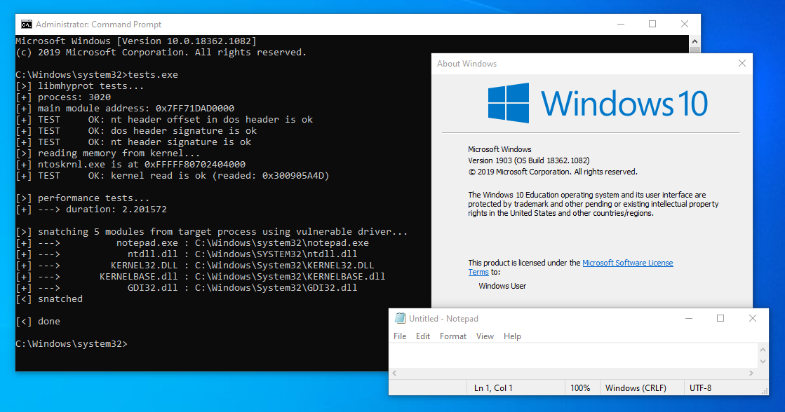
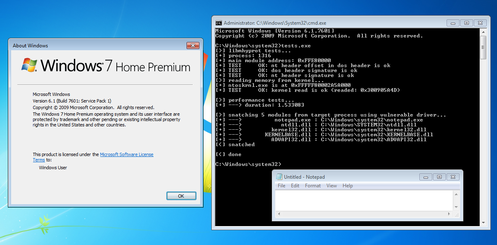
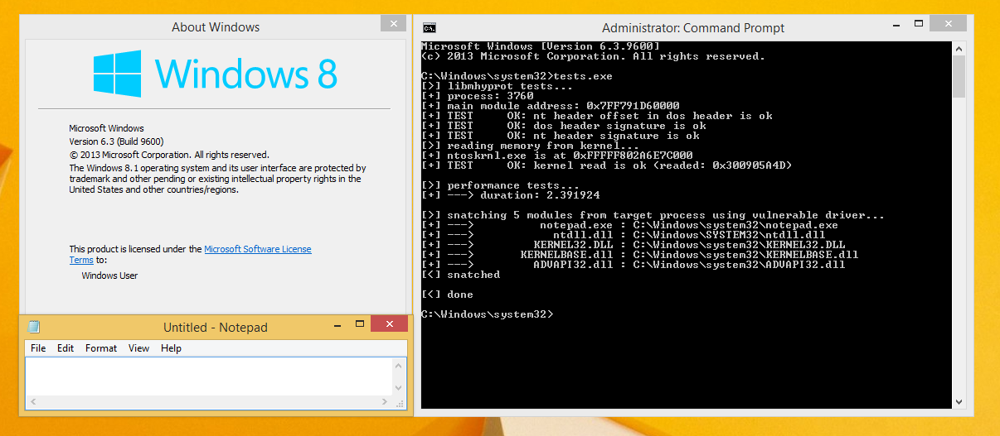

<p align="center"></p>
<p align="center">
  
  
  
</p>





# libmhyprot
A static library, wrapper for mhyprot vulnerable driver, execute exploits and tests

### The exploit PoC explained here: [evil-mhyprot-cli](https://github.com/kkent030315/evil-mhyprot-cli)

# Features

- Read Kernel Memory
- Read Process Memory
- Write Process Memory
- Get Process Modules
- Get Process Threads (**New**)
- Get System Uptime (**New**)
- Terminate Process (**New**)

All of operations above will be executed using vulnerable driver, with ring-0 privilege.  
Basically we need to be access-granted by the system using process handle, but we do not even need it.

# Requirements

- Only supports x64
- Might be work on any Windows version that the driver works on

Tested on:
- Windows10 x64 1903
- Windows7 x64 6.1
- Windows8.1 x64 6.3

# Usage

### 1. Include header

```cpp
#include "libmhyprot.h"
```

### 2. Init

```cpp
libmhyprot::mhyprot_init() -> bool
```

### 3. Executions

You can use templates to call functions as follows:

```cpp
using namespace libmhyprot;
read_kernel_memory(addr, buf, size); /*or*/ read_kernel_memory<T>(addr);
read_process_memory(pid, addr, buf, size); /*or*/ read_process_memory<T>(pid, addr);
write_process_memory(pid, addr, buf, size); /*or*/ write_process_memory<T>(pid, addr, val);
```

### 4. Unload

Please note that if you did not call this, the vulnerable driver will remains on your system.

```cpp
libmhyprot::mhyprot_unload() -> void
```
