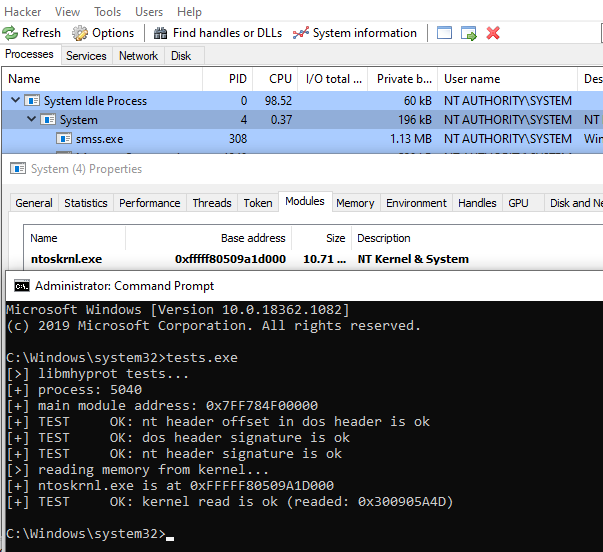

# libmhyprot
A static library, wrapper for mhyprot vulnerable driver, execute exploits and tests

### The exploit PoC explained here: [evil-mhyprot-cli](https://github.com/kkent030315/evil-mhyprot-cli)

# Requirements

- Only supports x64
- Might be work on any Windows version that the driver works on (not yet tested)

# Usage

### 1. Include header

```cpp
#include "libmhyprot.h"
```

### 2. Init

```cpp
libmhyprot::mhyprot_init() -> bool
```

### 3. Executions

You can use templates to call functions as follows:

```cpp
using namespace libmhyprot;
read_kernel_memory(addr, buf, size); /*or*/ read_kernel_memory<T>(addr);
read_user_memory(pid, addr, buf, size); /*or*/ read_user_memory<T>(pid, addr);
write_user_memory(pid, addr, buf, size); /*or*/ write_user_memory<T>(pid, addr, val);
```

### 4. Unload

Please note that if you did not call this, the vulnerable driver will remains on your system.

```cpp
libmhyprot::mhyprot_unload() -> void
```
